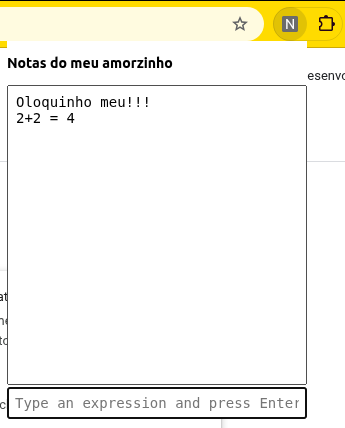

# chrome-extension-notepad-calculator

## Descrição 

Uma extensão simples para o Chrome que consiste em um bloco de notas e uma calculadora.

A pedido do meu amorzinho, pois a extensão similar que ela utilizava para trabalhar parou de funcionar.

## Stack

É só um html, um javascript, e um CSS paizão. Não tem segredo!

## Instalando

- Abra sessão de extensões do Chrome
- Ative a opção "Modo de desenvolvedor"
- Clique em "Carregar sem compactação"
- Selecione a pasta raíz do projeto
